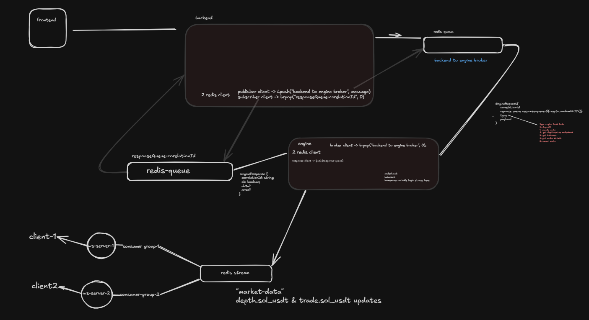

# Centralised Spot Exchange

A centralised spot exchange built with independent services for API handling, order matching, and real-time market-data delivery.

---

## Architecture



---

## Data Flow

### Order Flow

```text
Client
  │
  │ HTTP
  ▼
Backend
  │
  │ Redis Queue (backend-to-engine-broker)
  ▼
Matching Engine
  │
  ├── Validate & lock balance
  ├── Match orders
  ├── Update order book
  └── Generate trade events
  │
  ▼
Backend
  │
  ▼
Client
```

### Market Data Flow

```text
Matching Engine
      │
      │ Redis Stream ("market-data")
      ▼
WebSocket Server
      │
      │ WebSocket
      ▼
WebSocket Client
      │
      ▼
Local Order Book
```

---

## Services

- **Backend** – REST API for authentication, deposits, orders, cancellations, balances, and order-book queries. Talks to the matching engine over a Redis request/response queue and persists orders, fills, and balances to PostgreSQL via Prisma.
- **Matching Engine** – Maintains in-memory order books and handles order matching, fills, cancellations, and balance settlement.
- **WebSocket Server** – Consumes market-data events from the Redis Stream and broadcasts them to subscribed clients.
- **WebSocket Client** – Connects to the exchange's WebSocket server, consumes order-book updates, synchronizes them with a snapshot using update sequence IDs, and maintains a local order book.
- **Redis** – Provides asynchronous request/response communication between the backend and matching engine, and distributes market-data events through a Redis Stream.
- **PostgreSQL** – Stores persistent application data (users, balances, orders, fills).
- **Prisma** – Handles database access from the backend.

> This repo does not include a frontend. The `Client` in the diagrams above is any HTTP/WebSocket consumer of the backend and WebSocket server.

---

## Core Features

- Limit and market orders
- Price-time priority matching
- Partial order fills
- Order cancellation
- Balance locking and settlement
- In-memory order books
- Real-time order-book and trade updates over WebSocket
- Redis-based asynchronous service communication
- Redis Stream-based market-data distribution
- External WebSocket market-data ingestion

---

## API Routes

All routes below except `/signup` and `/signin` require an `Authorization: Bearer <token>` header.

### Authentication

| Method | Route | Description |
|---|---|---|
| `POST` | `/signup` | Create a new user (`username`, `password`) |
| `POST` | `/signin` | Authenticate a user and receive a JWT |

### Account

| Method | Route | Description |
|---|---|---|
| `POST` | `/deposit` | Deposit funds into an account |
| `GET` | `/balance` | Get the authenticated user's balances |

### Orders

| Method | Route | Description |
|---|---|---|
| `POST` | `/order` | Create a new order |
| `GET` | `/order/:orderId` | Get an order by ID |
| `DELETE` | `/order/:orderId` | Cancel an open order |

### Market Data

| Method | Route | Description |
|---|---|---|
| `GET` | `/depth/:symbol` | Get current order-book depth |

---

## Setup

### 1. Clone

```bash
git clone https://github.com/SurajNakhale/centralised-exchange.git
cd centralised-exchange
```

### 2. Install Dependencies

```bash
cd backend
bun install

cd ../engine
bun install

cd ../ws-server
bun install

cd ../ws-client
bun install
```

### 3. Environment Variables

Backend (`backend/.env`):

```env
PORT=3000
DATABASE_URL=
REDIS_URL=
JWT_SECRET=
INCOMING_QUEUE=backend-to-engine-broker
ENGINE_TIMEOUT_MS=30000
```

Engine (`engine/.env`):

```env
REDIS_URL=
INCOMING_QUEUE=backend-to-engine-broker
```

WebSocket Server (`ws-server/.env`):

```env
REDIS_URL=
```

WebSocket Client (`ws-client/.env`):

```env
WS_SEVER_URL=
```

> `REDIS_URL` must point to the same Redis instance/port for the backend, engine, and WebSocket server. `INCOMING_QUEUE` must match between backend and engine. `WS_SEVER_URL` should point at the running WebSocket Server (e.g. `ws://localhost:8080`) — note the env var is spelled `WS_SEVER_URL` in the code, not `WS_SERVER_URL`.

### 4. Database

```bash
cd backend
bunx prisma generate
bunx prisma migrate dev
```

The Prisma schema requires at least one `Asset` (matching an order/deposit `symbol`) and one `Market` (matching an order's trading pair `symbol`) to exist before `/deposit` or `/order` will succeed — there is currently no seed script, so add these rows manually (e.g. via `bunx prisma studio`) after migrating.

### 5. Start Redis

```bash
docker run -d --name redis -p 6379:6379 redis
```

### 6. Start Services

Run each service in a separate terminal.

```bash
# Backend
cd backend
bun run dev
```

```bash
# Engine
cd engine
bun run dev
```

```bash
# WebSocket Server
cd ws-server
bun src/index.ts
```

```bash
# WebSocket Client
cd ws-client
bun run dev
```

---

## Example

### Signup

```http
POST /signup
Content-Type: application/json
```

```json
{
  "username": "trader1",
  "password": "password"
}
```

### Create Order

```http
POST /order
Authorization: Bearer <token>
Content-Type: application/json
```

```json
{
  "type": "limit",
  "side": "buy",
  "symbol": "sol/usdt",
  "price": 100,
  "qty": 2
}
```

### Get Order Book

```http
GET /depth/sol/usdt
Authorization: Bearer <token>
```

### Cancel Order

```http
DELETE /order/<orderId>
Authorization: Bearer <token>
```

---

## WebSocket

Connect to the WebSocket Server (default `ws://localhost:8080`) and subscribe to market-data topics:

```json
{ "method": "SUBSCRIBE", "params": ["depth.sol_usdt", "trade.sol_usdt"] }
```

```json
{ "method": "UNSUBSCRIBE", "params": ["depth.sol_usdt", "trade.sol_usdt"] }
```

Topics follow `depth.<symbol>` and `trade.<symbol>`, published by the matching engine to the `market-data` Redis Stream and fanned out to subscribed sockets by the WebSocket Server.

---

## Project Structure

```text
centralised-exchange/
│
├── backend/
│   ├── prisma/
│   │   ├── generated/
│   │   ├── migrations/
│   │   └── schema.prisma
│   ├── Dockerfile
│   └── src/
│       ├── controllers/
│       ├── routes/
│       ├── store/
│       ├── types/
│       └── utils/
│
├── engine/
│   └── src/
│       ├── deposit/
│       ├── market-data/
│       ├── order/
│       ├── types/
│       └── utils/
│
├── ws-server/
│   └── src/
│       ├── index.ts
│       └── redis-consumer.ts
│
├── ws-client/
│   └── index.ts
│
└── docs/
    └── cexv2.png
```

---

## Tech Stack

- TypeScript
- Bun
- Express
- Redis
- Redis Streams
- WebSockets (`ws`)
- PostgreSQL
- Prisma
- JWT
- bcrypt
- Zod
- Decimal.js
- Axios
